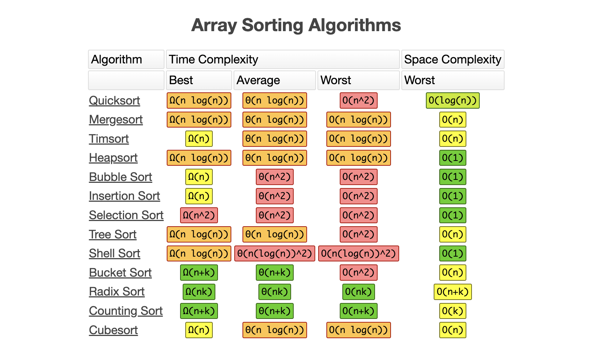

# T2A1-B: Workbook Part B 

## Big 0 Notation

"Big O notation" or "Order of" was first introduced by German mathematician Paul Bachmann back in 1894. It's part of a family of Bachmann–Landau notations. The capital letter `O` means "Order of Approximation".

Big O is used to describe the time complexity and efficiency of algorithms. This notation puts the number of steps in the spotlight and the hardware is not taken into consideration. Big O notation describes the upper bound of an algorithm's time or space complexity, this means Big O generally describes the worse case scenario.

When calculating Big O notation, the focus is on the "Dominant term" which is the term that grows the fastest as the input size gets larger, this will determine the complexity of an algorithm. When describing the complexity we ignore the smaller terms and the constant and we describe the dominant term. 

Big O is a very powerful tool for developers because it helps to see the function's efficiency as the data input grows, it gives developers an idea how a certain function will perform with different data sizes. Understanding the Big O, gives the developers the option to choose the best performing algorithm to solve their problems and complete a function.

### Types of complexity:

### O(1) - Constant

As the data grows, the number of steps stays the same, no matter how small or big the data is. In this algorithm a value will be selected and return. In the example bellow, no matter how many items are in this array, the function with return the element with the index value of zero. O(1) has the least complexity.

### Example of Constant time complexity algorithm

    def get_first_element(arr):
    return arr[0]

### O(log n) - Logarithmic

As the data grows large, the Logarithmic complexity becomes smaller relative to the growth when compared to Linear and Quadratic complexities. 

This type of complexity is commonly seen in algorithms that divide data into two halves, such as Binary Search. Such division typically results in O(log n) complexity.

O(log n) is more complex than O(1) but less complex than polynomials O(n) and O(n^2).

#### Function to find the X value, and how many steps it takes
    def binary_search_with_steps(arr, x):
        # Set low side of array to 0
        low = 0
        # Set high to the array length -1 to access index
        high = len(arr) - 1
        # Initialise steps to zero
        steps = 0
        
        # While loop, half the array to find the MID array
        # Increment the steps to 1
        while low <= high:
            steps += 1  
            mid = (low + high) // 2
            
            if arr[mid] == x:
                return mid, steps  
            elif arr[mid] < x:
                low = mid + 1
            else:
                high = mid - 1
        
        return -1, steps  

    print(binary_search_with_steps([1, 5, 8, 12, 20, 21, 35], 8))

### O(n) - Linear

As the size of the dataset increases, the time complexity grows at the same rate. In the worst case scenario, the algorithm requires a number of steps equal to the number of elements in the input dataset.

#### Function that counts the occurrences of a value in an input dataset

    def count_values(arr, val):
        count = 0
        for each in arr:
            if each == val:
                count += 1 
        
        return f"Occurrence of {val} value is {count} times."

    print(count_values([1,2,1,1,3],1))

### O(n^2) Quadratic

Typically involves nested loops, where the time complexity increases quadratically as the size of the input data grows.

#### Example Bubble algorithm that compares each value to each other value 

    def bubble_sort(arr):
        n = len(arr)
        for i in range(n):
            for j in range(0, n-i-1):
                if arr[j] > arr[j+1]:
                    arr[j], arr[j+1] = arr[j+1], arr[j]
        return arr

    print(bubble_sort([64, 34, 24, 12, 22, 13, 95]))

    Output : [12, 13, 22, 24, 34, 64, 95]

### O(2n) Exponential

This algorithm grows the quickest compared to the past examples given above. Factorial complexity grows quicker than Exponential algorithms.

#### Comparison between Exponential and Factorial:

    Exponential: 2^10 = 1024 (where n = 10, base = 2) 
    2x 2x 2x 2x 2x 2x 2x 2x 2x 2 = 1024
    
    Factorial: 10! (where n = 10!)
    10x 9x 8x 7x 6x 5x 4x 3x 2x 1 = 3,628,800

Exponential algorithm doubles with dataset addition. This is common in recursing algorithms that call themselves multiple times. Exponential algorithms should be avoided because it has very high complexity and uses a lot of memory.

#### Exponential Fibonacci example 

    def fibonacci(n):
        if n <= 0:
            return 0
        elif n == 1:
            return 1
        else:
            # Function calls itself twice here
            return fibonacci(n-1) + fibonacci(n-2) 

    # Example usage
    print(fibonacci(3))

## Types of algorithms:

#### Searching Algorithm
These algorithms are used to search for a specific key (value) in a given list.

Examples of Searching algorithms:

- <b>Binary search</b>:

    - <b>Description</b>: It compares the element in the middle of the sorted array to the target value. If the target matches the element, it returns the index of that element. If the target is smaller than the element, the algorithm discards the upper half and continues the search in the lower half. Conversely, if the target is larger, the search continues in the upper half. This process repeatedly narrows down the search range by half until the target value is found.

    - <b>Performance</b>: Efficient for sorted arrays and large lists. This algorithm can't be used in unordered lists.

    - <b>Complexity</b>: Worse case scenario: O(log n)  

- <b>Linear search</b>: 
    - <b>Description</b>: Checks each element sequentially to find the specific value, if no element is found, the algorithm concludes that element is not present.

    - <b>Performance</b>: Easy to implement, and efficient for small and unordered lists.

    - <b>Complexity</b>: Worse case scenario: O(n) 

#### Sorting Algorithms

Sorting algorithm is the number of steps it takes to put a list in specific order, example: smallest to largest. The main goal of this algorithm is to organise data so data can be easily read and searched through. 

Examples of Sorting Algorithms: 

- <b>Bubble Sort</b>: 

    - <b>Description</b>: Compare adjacent elements and swap them to achieve order.

    - <b>Performance</b>: Inefficient for large datasets, for simple tasks performance can be ok. 

    - <b>Complexity</b>: Worst case scenario: O(n^2)

- <b>Insertion sort</b>:

    - <b>Description</b>: Sorts the array by swapping elements into the correct places, one by one.

    - <b>Performance</b>: Efficient for small datasets or nearly sorted arrays.

    - <b>Complexity</b>: Worst case scenario: O(n^2)

- <b>Merge sort</b>: 

    - <b>Description</b>: It is a divide-and-conquer algorithm. The Merge Sort algorithm divides the array into two halves, sorts each half, and then merges the two sorted halves back together.

    - <b>Performance</b>: Stable sorting and efficient for large datasets. 

    - <b>Complexity</b>: Worse case scenario: O(log n)

- <b>Selection sort</b>: 

    - <b>Description</b>: It finds the smallest or largest element and moves it to the end of the sorted portion of the array. This process repeats until the entire array is sorted.

    - <b>Performance</b>: Inefficient for large datasets, easy to implement. 

    - <b>Complexity</b>: Worst case scenario: O(n^2)

- <b>Quick sort</b>: 
    
    - <b>Description</b>: It is a divide-and-conquer algorithm. Quick sort Algorithm chooses the pivot element and divides the array into two halves, example: elements less than pivot and elements greater than the pivot. The same process is performed again with left and right halves until all elements are ordered.

    - <b>Performance</b>: Efficient for large datasets. 

    - <b>Complexity</b>: Worst case scenario: O(n^2)

#### Screen shoots that describes complexity for sorting algorithms and common 

‌
‌Rowell, E. (2019). Big-O Algorithm Complexity Cheat Sheet (Know Thy Complexities!). [online] Bigocheatsheet.com. Available at: https://www.bigocheatsheet.com/.

geeksforgeeks (2018). Analysis of Algorithms | Big-O analysis - GeeksforGeeks. [online] GeeksforGeeks. Available at: https://www.geeksforgeeks.org/analysis-algorithms-big-o-analysis/.

Huang, S. (2020). What is Big O Notation Explained: Space and Time Complexity. [online] freeCodeCamp.org. Available at: https://www.freecodecamp.org/news/big-o-notation-why-it-matters-and-why-it-doesnt-1674cfa8a23c/.

Peng, Y. (2023). Time Complexity: Everything You Need to Know! - Ying Peng - Medium. [online] Medium. Available at: https://medium.com/@yingpeng0221/time-complexity-everything-you-need-to-know-712254c178e4 [Accessed 29 Aug. 2024].

‌

## Q1 

### Bubble Sort - O(n^2)

Bubble Sort is a type of sorting algorithm. It compares each element with each other element, swapping them if needed to achieve an organised order. This process involves comparing adjacent elements and swapping them to ensure the larger elements "bubble up" to their correct positions, hence the name "Bubble Sort."

Bubble Sort uses nested loops: an outer loop and an inner loop. Both loops have linear complexity, and when combined, this results in a quadratic complexity, represented as O(n²).

Outer Loop: The outer loop runs through the list or array multiple times until the entire list is sorted. If the array has `n` elements, this loop typically runs `n-1` times.

Inner Loop: The inner loop compares adjacent elements. If the current element is greater than the next element, they are swapped; otherwise, if the current element is smaller, no action is taken and the loop continues. As the sorting progresses, larger elements gradually move to their correct positions, and the number of required iterations decreases.

Bubble Sort algorithm is represented by O(n^2) Quadratic complexity in Big O notation. Big O notations always consider the worst case scenario. However, complexity notations can change depending if algorithm complexity increases or decreases. Bubble sort best case scenario occurs when array is sorted already and swap flag is used, this will improve the complexity from O(n^2) to O(n) - Linear complexity due to the outer loop running only once.

Considering the best case scenario in Bubble Sort with the arr = [1, 2, 3, 4, 6, 33] and swap flag (Boolean value), the algorithm will improve to Linear complexity since the list is already ordered. The outer loop will run once, the inner loop will run "n - 1" times where n is equal to number of elements. The loop will exit after no swaps were performed. The total number of steps taken in this scenario is 5. 

Quadratic complexity is usually found in algorithms that perform nested loops to compare elements, other algorithms that also has this type of complexity are Selection Sort and Insertion Sort.

Quadratic complexity is very high because the number of steps increases proportionally to the square of the input size. These Algorithms perform operations and comparisons on each element against each other element in the list.

Some positive aspects about the Bubble Algorithm include being simple to understand and easy to implement. It's straightforward and it makes a great option for educational purposes. It can be more suited to small and simple tasks rather than more complex functions. It is a stable algorithm, meaning it preserves the relative order of elements with equal values. This is crucial when sorting by multiple criteria, as it ensures that equal elements remain in their original order relative to each other. However, this algorithm becomes very inefficient when dealing with larger datasets because the complexity grows extremely fast as the input data grows.  

### Worse case scenario
In this scenario, the order is in inverse, which means the loops will interact over all elements and perform the maximum number of operations (swaps) to sort elements. 

    def bubbleSort(arr):
        # 'n' variable stores the elements of the list
        n = len(arr)
        
        # Outer loop runs 'n' times
        # Each run ensures larger numbers are placed towards the end of the list 
        for i in range(n):

            # Inner loop runs from the first to last element minus the ordered elements
            for j in range(0, n-i-1):
                # Compares the actual element with the next element (adjacent pairs)
                # If the actual element is greater than actual, it swap places
                # Larger element moves to the right hand side
                if arr[j] > arr[j+1]:
                    arr[j], arr[j+1] = arr[j+1], arr[j]
                
    # Example list
    arr = [33, 6, 4, 3, 2, 1]

    # Sort the list
    bubbleSort(arr)

    # Print the sorted list
    print("Sorted list:", arr)

### Step-by-Step Sorting Process:

    Pass 1:
    arr = [33, 6, 4, 3, 2, 1]
    Compare 33 and 6: Since 33 > 6, swap them.
    New list: [6, 33, 4, 3, 2, 1]
    Compare 33 and 4: Since 33 > 4, swap them.
    New list: [6, 4, 33, 3, 2, 1]
    Compare 33 and 3: Since 33 > 3, swap them.
    New list: [6, 4, 3, 33, 2, 1]
    Compare 33 and 2: Since 33 > 2, swap them.
    New list: [6, 4, 3, 2, 33, 1]
    Compare 33 and 1: Since 33 > 1, swap them.
    New list: [6, 4, 3, 2, 1, 33]
    Result after Pass 1: [6, 4, 3, 2, 1, 33]
    The largest element, 33, has "bubbled" to its correct position at the end.

    Pass 2:
    Compare 6 and 4: Since 6 > 4, swap them.
    New list: [4, 6, 3, 2, 1, 33]
    Compare 6 and 3: Since 6 > 3, swap them.
    New list: [4, 3, 6, 2, 1, 33]
    Compare 6 and 2: Since 6 > 2, swap them.
    New list: [4, 3, 2, 6, 1, 33]
    Compare 6 and 1: Since 6 > 1, swap them.
    New list: [4, 3, 2, 1, 6, 33]
    Result after Pass 2: [4, 3, 2, 1, 6, 33]
    The second largest element, 6, is now in its correct position, just before 33.

    Pass 3:
    Compare 4 and 3: Since 4 > 3, swap them.
    New list: [3, 4, 2, 1, 6, 33]
    Compare 4 and 2: Since 4 > 2, swap them.
    New list: [3, 2, 4, 1, 6, 33]
    Compare 4 and 1: Since 4 > 1, swap them.
    New list: [3, 2, 1, 4, 6, 33]
    Result after Pass 3: [3, 2, 1, 4, 6, 33]
    The third largest element, 4, is now in its correct position.

    Pass 4:
    Compare 3 and 2: Since 3 > 2, swap them.
    New list: [2, 3, 1, 4, 6, 33]
    Compare 3 and 1: Since 3 > 1, swap them.
    New list: [2, 1, 3, 4, 6, 33]
    Result after Pass 4: [2, 1, 3, 4, 6, 33]
    The fourth largest element, 3, is now in its correct position.

    Pass 5:
    Compare 2 and 1: Since 2 > 1, swap them.
    New list: [1, 2, 3, 4, 6, 33]
    Result after Pass 5: [1, 2, 3, 4, 6, 33]
    The fifth largest element, 2, is now in its correct position.

    Pass 6:
    No comparisons are needed since only one element is left unsorted (smallest element).
    List is sorted.
    Final Sorted List:
    [1, 2, 3, 4, 6, 33]

### Average case scenario
Using the `swap` Boolean flag, the loops are able to terminate earlier if list is already sorted thereby eliminating the need to complete all interactions, this increases efficiency. The example bellow presents the same code with Boolean flag added. This still a quadratic complexity.

    def bubbleSort(arr):
        # 'n' variable stores the elements of the list
        n = len(arr)
        
        # Outer loop runs 'n' times
        # Each run ensures larger numbers are placed towards the end of the list
        # Swap checks if elements have been swapped 
        for i in range(n):
            swapped = False

            # Inner loop runs from the first element to the last element minus the ordered elements
            for j in range(0, n-i-1):
                # Compares the actual element with the next element (adjacent pairs)
                # If the actual element is greater than actual, it swap places
                # Larger element moves to the right hand side
                if arr[j] > arr[j+1]:
                    arr[j], arr[j+1] = arr[j+1], arr[j]
                    # If changes occur, swapped condition = True
                    swapped = True
            # Loop exit if no more swaps are performed, it means list is ordered.
            if (swapped == False):
                break

    # Example list
    arr = [1, 4, 2, 6, 33, 3]

    # Sort the list
    bubbleSort(arr)

    # Print the sorted list
    print("Sorted list:", arr)

References:

Notes taken from ED/Canvas and past Zoom classes.

GeeksforGeeks. (2014). Bubble Sort Algorithm. [online] Available at: https://www.geeksforgeeks.org/bubble-sort-algorithm/.

## Q2

### Merge Sort - O(n log n)

Merge sort is a divide-and-conquer algorithm. When compared to the Bubble sorting algorithm example given in the question number 01 and other common sorting algorithms, Merge sort is more reliable and has a guaranteed worse case scenario of O(n log n). This complexity is achieved because the Merge Algorithm always divide initial input data into halves. Some other advantages of Merge include being a stable algorithm and being easy to understand and implement.

Merge works by dividing the array into two halves and sorting each half first. Once the halves are sorted, it merges halves back together. The initial order doesn't play a part in Merge sort.

Since the algorithm divides and arrange each sub-array separately, it requires more memory to store arranged sub-arrays before merging them together. In case of larger datasets or environments with memory restrictions, this can be a disadvantage and another option would be Quick Sort requires less extra memory compared to Merge sort. 

#### Bellow is an illustration how Merge Sort works

Where to use Merge sort:
- Large databases
- External sorting (large amount of data in external memory)
- Inversion sorting (indicates how far the array is from being ordered)
- To find Union and Intersection of two sorted arrays
- Sort linked lists

#### Example of a Merge sort function

    def merge_sort(arr):
        # Array with one or less elements
        if len(arr) <= 1:
            return arr
        
        # Divide the array into two halves - O(log n) Complexity
        mid = len(arr) // 2
        left_half = arr[:mid]
        right_half = arr[mid:]
        
        # Sort arrays and store values in variables 
        left_sorted = merge_sort(left_half)
        right_sorted = merge_sort(right_half)
        
        # Merge the sorted halves
        return merge(left_sorted, right_sorted)

    def merge(left, right):
        sorted_arr = []
        i = j = 0
        
        # Compare the elements of the left and right halves and merge them
        # O(n) Complexity
        while i < len(left) and j < len(right):
            if left[i] < right[j]:
                sorted_arr.append(left[i])
                i += 1
            else:
                sorted_arr.append(right[j])
                j += 1
        
        # If there are remaining elements in the left half, add them to the sorted array
        sorted_arr.extend(left[i:])
        
        # If there are remaining elements in the right half, add them to the sorted array
        sorted_arr.extend(right[j:])
        
        return sorted_arr

    # Example usage:
    arr = [38, 27, 43, 3, 9, 82, 10]
    sorted_arr = merge_sort(arr)
    print("Sorted array:", sorted_arr)

References:

GeeksforGeeks (2018). Merge Sort - GeeksforGeeks. [online] GeeksforGeeks. Available at: https://www.geeksforgeeks.org/merge-sort/.

‌

