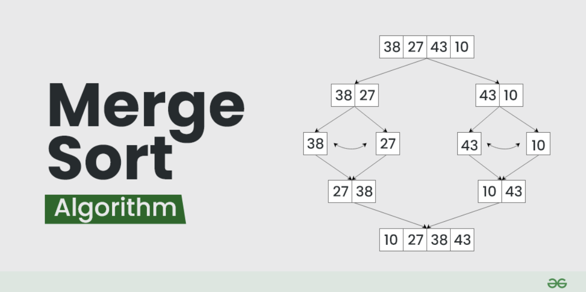
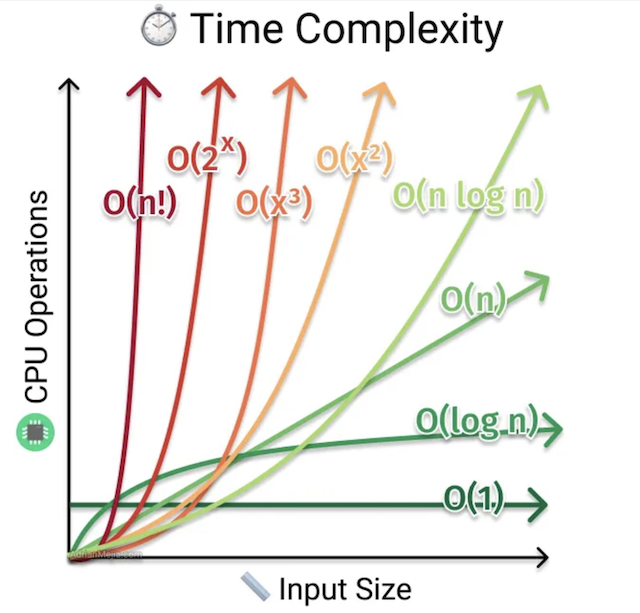
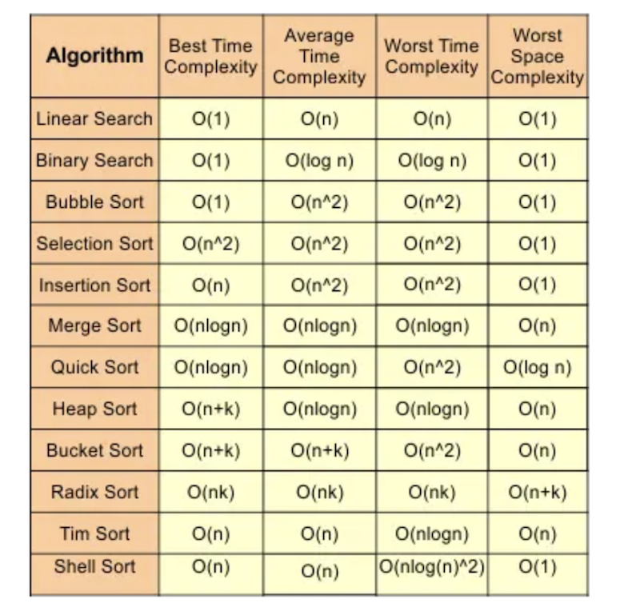

# T2A1-B: Workbook Part B 

## Q1 

### Bubble Sort - O(n^2)

The bubble Sort is a type of sorting algorithm. It compares each element with each other element, swapping them if needed, to achieve an organised order. This process involves comparing adjacent elements and swapping them to ensure the larger elements "bubble up" to their correct positions, hence the name "Bubble Sort."

Sorting algorithms arrange the elements in a list or array into a specific order, such as ascending (smallest to largest) or descending (largest to smallest). The main goal of this algorithm is to organise data so it can be easily read and searched through.

The Bubble Sort algorithm is represented by O(n^2) Quadratic complexity in Big O notation. Big O notation or "Order of" was first introduced by German mathematician Paul Bachmann back in 1894. It's part of a family of Bachmann–Landau notations. The upper letter `O` means "Order of Approximation".

Big O is used to describe time complexity and efficiency of algorithms. Efficiency can be the result of taken time or memory usage to solve a problem or complete a task. Big O puts the number of steps in the spotlight and the hardware is not taken into consideration. There are 3 types of scenarios: the worse case scenario, the average case scenario and the best case scenario. Big O generally describes the worst case scenario.

When calculating Big O notation, the focus is on the "Dominant term" which is the term that grows the fastest as the input size gets larger, this is the factor that determines the complexity of an algorithm. When describing the algorithm's complexity, the smaller terms and the constant are ignored.  

The Big O notation is a powerful tool because it shows how a function's efficiency changes as the input data grows. It provides insight into how a particular function will perform with different data sizes. By understanding Big O, you can select the best-performing algorithm to solve problems and complete tasks efficiently.

The Bubble Sort uses nested loops: an outer loop and an inner loop. Both loops have linear complexity, and when combined, they result in quadratic complexity, represented as O(n²).

Outer Loop: The outer loop runs through the list or array multiple times until the entire list is sorted. If the array has `n` elements, this loop typically runs `n-1` times.
Inner Loop: The inner loop compares adjacent elements. If the current element is greater than the next element, they get swapped. Otherwise, if the current element is smaller, no action is taken and the loop continues. As the sorting progresses, larger elements gradually move to their correct positions, and the number of required iterations decreases.

The Bubble Sort best case scenario occurs when array is sorted already and swap flag is used, this will improve the complexity from O(n^2) to O(n) - Linear complexity due to the outer loop running only once.

Considering the best case scenario in Bubble Sort with the arr = [1, 2, 3, 4, 6, 33] and swap flag (Boolean value), the algorithm will improve to Linear complexity since the list is already ordered. The outer loop will run once, the inner loop will run "n - 1" times where n is equal to number of elements. The loop will exit after no swaps were performed. The total number of steps taken in this scenario is 5. 

Quadratic complexity is commonly found in algorithms that use nested loops to compare elements. Examples of such algorithms include Selection Sort and Insertion Sort. These algorithms typically perform operations and comparisons between each element and every other element in the list.

This complexity is considered high because the number of steps grows proportionally to the square of the input size.

Some positive aspects about the Bubble Algorithm include being simple to understand and easy to implement. It's straightforward and it makes a great option for educational purposes. It can be more suited to small and simple tasks rather than more complex functions. It is a stable algorithm, meaning it preserves the relative order of elements with equal values. This is crucial when sorting by multiple criteria, as it ensures that equal elements remain in their original order relative to each other. However, this algorithm becomes very inefficient when dealing with larger datasets because the complexity grows extremely fast as the input data grows.  

### Bubble sort worse case scenario

In this scenario, the order is in inverse. The loops will interact over all elements and perform the maximum number of operations (swaps) to sort elements. 

    def bubbleSorting(arr):
        # 'n' variable stores the elements of the list
        n = len(arr)
        
        # Outer loop runs 'n' times
        # Each run ensures larger numbers are placed towards the end of the list 
        for i in range(n):

            # Inner loop runs from the first to last element minus the ordered elements
            for j in range(0, n-i-1):
                # Compares the actual element with the next element (adjacent pairs)
                # If the actual element is greater than actual, it swap places
                # Larger element moves to the right hand side
                if arr[j] > arr[j+1]:
                    arr[j], arr[j+1] = arr[j+1], arr[j]
                

### Step-by-Step Sorting Process:

This process is repeated until the list is completely ordered.

    Pass 1:
    arr = [33, 6, 4, 3, 2, 1]
    Compare 33 and 6: Since 33 > 6, swap them.
    New list: [6, 33, 4, 3, 2, 1]
    Compare 33 and 4: Since 33 > 4, swap them.
    New list: [6, 4, 33, 3, 2, 1]
    Compare 33 and 3: Since 33 > 3, swap them.
    New list: [6, 4, 3, 33, 2, 1]
    Compare 33 and 2: Since 33 > 2, swap them.
    New list: [6, 4, 3, 2, 33, 1]
    Compare 33 and 1: Since 33 > 1, swap them.
    New list: [6, 4, 3, 2, 1, 33]
    Result after Pass 1: [6, 4, 3, 2, 1, 33]
    The largest element, 33, has "bubbled" to its correct position at the end.

### Average case scenario
By using the `swap` Boolean flag, the loop can terminate earlier if list is already sorted. Thereby, eliminating the need to complete all interactions and increasing efficiency. The example bellow presents the same code with the Boolean flag added. The complexity remains quadratic.

    def bubbleSort(arr):
        # 'n' variable stores the elements of the list
        n = len(arr)
        
        # Outer loop runs 'n' times
        # Each run ensures larger numbers are placed towards the end of the list
        # Swap checks if elements have been swapped 
        for i in range(n):
            swapped = False

            # Inner loop runs from the first element to the last element minus the ordered elements
            for j in range(0, n-i-1):
                # Compares the actual element with the next element (adjacent pairs)
                # If the actual element is greater than actual, it swap places
                # Larger element moves to the right hand side
                if arr[j] > arr[j+1]:
                    arr[j], arr[j+1] = arr[j+1], arr[j]
                    # If changes occur, swapped condition = True
                    swapped = True
            # Loop exit if no more swaps are performed, it means list is ordered.
            if (swapped == False):
                break

### Merge Sort - O(n log n)

The Merge sort is a divide-and-conquer algorithm. When compared to the Bubble sorting algorithm example given in the question number 01 and other common sorting algorithms, Merge sort is more reliable and has a guaranteed worse case scenario of O(n log n). This complexity is achieved because the Merge Algorithm always divide initial input data into halves. Some other advantages of Merge include being a stable algorithm and being easy to understand and implement.

The Merge sort algorithm works by dividing the array into two halves and sorting each sub-array. Once sub-arrays are sorted, it merges them back together. The initial order of the elements does not affect the Merge sort.

Since the algorithm divides and arrange each sub-array separately, it requires more memory to store arranged sub-arrays before merging them together. In case of larger datasets or environments with memory restrictions, this can be a disadvantage and another option would be Quick Sort requires less extra memory compared to Merge sort. 

#### Bellow is an illustration how Merge Sort works

#### Example of a Merge sort function

    def merge_sort(arr):
        # Array with one or less elements
        if len(arr) <= 1:
            return arr
        
        # Divide the array into two halves - O(log n) Complexity
        mid = len(arr) // 2
        left_half = arr[:mid]
        right_half = arr[mid:]
        
        # Sort arrays and store values in variables 
        left_sorted = merge_sort(left_half)
        right_sorted = merge_sort(right_half)
        
        # Merge the sorted halves
        return merge(left_sorted, right_sorted)

    def merge(left, right):
        sorted_arr = []
        i = j = 0
        
        # Compare the elements of the left and right halves and merge them
        # O(n) Complexity
        while i < len(left) and j < len(right):
            if left[i] < right[j]:
                sorted_arr.append(left[i])
                i += 1
            else:
                sorted_arr.append(right[j])
                j += 1
        
        # If there are remaining elements in the left half, add them to the sorted array
        sorted_arr.extend(left[i:])
        
        # If there are remaining elements in the right half, add them to the sorted array
        sorted_arr.extend(right[j:])
        
        return sorted_arr

#### Where to use Merge sort:
- Large databases
- External sorting (large amount of data in external memory)
- Inversion sorting (indicates how far the array is from being ordered)
- To find Union and Intersection of two sorted arrays
- Sort linked lists

#### Examples of other Sorting Algorithms: 

- <b>Insertion sort</b>:

    - <b>Description</b>: Sorts the array by swapping elements into the correct places, one by one.

    - <b>Performance</b>: Efficient for small datasets or nearly sorted arrays.

    - <b>Complexity</b>: Worst case scenario: O(n^2)

- <b>Selection sort</b>: 

    - <b>Description</b>: It finds the smallest or largest element and moves it to the end of the sorted portion of the array. This process repeats until the entire array is sorted.

    - <b>Performance</b>: Inefficient for large datasets, easy to implement. 

    - <b>Complexity</b>: Worst case scenario: O(n^2)

- <b>Quick sort</b>: 
    
    - <b>Description</b>: It`s a divide-and-conquer algorithm. This algorithm chooses the pivot element and divides the array into two halves, example: elements less than pivot and elements greater than the pivot. The same process is performed again with left and right halves until all elements are ordered.

    - <b>Performance</b>: Efficient for large datasets. 

    - <b>Complexity</b>: Worst case scenario: O(n^2)

References:

GeeksforGeeks (2018). Merge Sort - GeeksforGeeks. [online] GeeksforGeeks. Available at: https://www.geeksforgeeks.org/merge-sort/.

Notes taken from ED/Canvas and past Zoom classes.

GeeksforGeeks. (2014). Bubble Sort Algorithm. [online] Available at: https://www.geeksforgeeks.org/bubble-sort-algorithm/.

## Q2

### Binary search - O(log n)

Binary search compares the element in the middle of the sorted array to the target value. If the target matches the element, it returns the index of that element. If the target is smaller than the element, the algorithm discards the upper half and continues the search in the lower half. Alternatively, if the target is larger, the search continues in the upper half. This process repeatedly narrows down the search range by half until the target value is found.

Binary search is efficient for sorted arrays and large lists however in order to work, the list needs to be sorted, this algorithm can't be performed in unordered lists. The complexity that describes this algorithm is O(log n).

Logarithmic complexity becomes smaller relative to the growth when compared to Linear and Quadratic complexities. This type of complexity is commonly seen in algorithms that divide data into two halves, such as Binary Search. Such division typically results in O(log n) complexity.

O(log n) is more complex than O(1) but less complex than polynomials O(n) and O(n^2).

#### Example of Binary search, function to find the X value, and how many steps it takes.
    def binary_search_with_steps(arr, x):
        # Set low side of array to 0
        low = 0
        # Set high to the array length -1 to access index
        high = len(arr) - 1
        # Initialise steps to zero
        steps = 0
        
        # While loop, half the array to find the MID array
        # Increment the steps to 1
        while low <= high:
            steps += 1  
            mid = (low + high) // 2
            
            if arr[mid] == x:
                return mid, steps  
            elif arr[mid] < x:
                low = mid + 1
            else:
                high = mid - 1
        
        return -1, steps  

### Linear search - O(n)
    
Linear search algorithm checks each element sequentially to find the specific value, if no element is found, the algorithm concludes that element is not present. As the size of the dataset increases, the time complexity grows at the same rate. In the worst case scenario, the algorithm requires a number of steps equal to the number of elements in the input dataset.

Linear algorithm is easy to implement, and efficient for small and unordered lists. Complexity that describes this algorithm is O(n) Linear. 

Linear search is less efficient than binary search because it checks each element one by one, while binary search repeatedly divides the data into halves, narrowing down the search more quickly.

Both Linear and Binary search algorithms can be improved to O(1) complexity if the target is found straightaway without any operations.

#### Example of Linear search, function that counts the occurrences of a value in an input dataset.

    def count_values(arr, val):
        count = 0
        for each in arr:
            if each == val:
                count += 1 
        
        return f"Occurrence of {val} value is {count} times."

#### Algorithms complexities and Big O graph.

‌
References:

cst (2023). Time Complexity Of Algorithms. [online] CS Taleem. Available at: https://cstaleem.com/time-complexity-of-algorithms [Accessed 29 Aug. 2024].

‌Rowell, E. (2019). Big-O Algorithm Complexity Cheat Sheet (Know Thy Complexities!). [online] Bigocheatsheet.com. Available at: https://www.bigocheatsheet.com/.

geeksforgeeks (2018). Analysis of Algorithms | Big-O analysis - GeeksforGeeks. [online] GeeksforGeeks. Available at: https://www.geeksforgeeks.org/analysis-algorithms-big-o-analysis/.

Huang, S. (2020). What is Big O Notation Explained: Space and Time Complexity. [online] freeCodeCamp.org. Available at: https://www.freecodecamp.org/news/big-o-notation-why-it-matters-and-why-it-doesnt-1674cfa8a23c/.

Peng, Y. (2023). Time Complexity: Everything You Need to Know! - Ying Peng - Medium. [online] Medium. Available at: https://medium.com/@yingpeng0221/time-complexity-everything-you-need-to-know-712254c178e4 [Accessed 29 Aug. 2024].